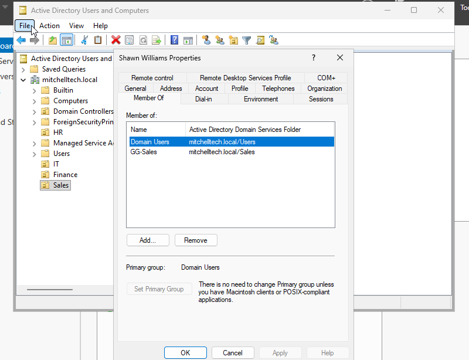
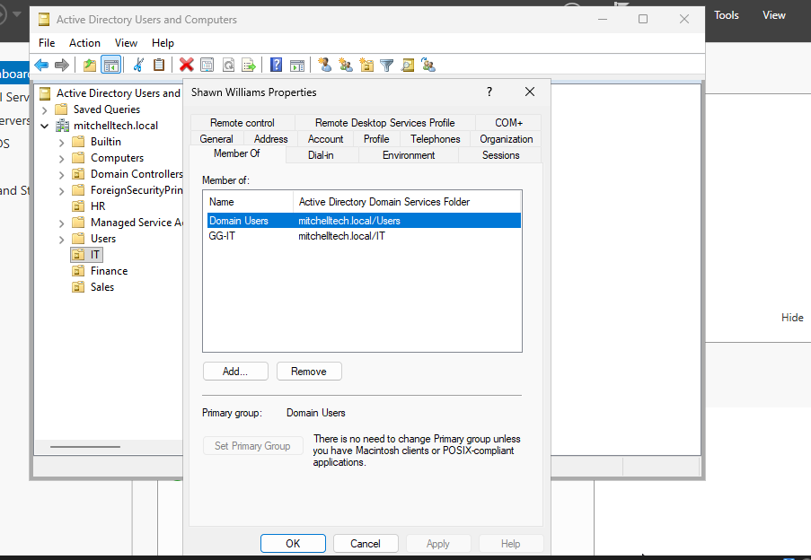
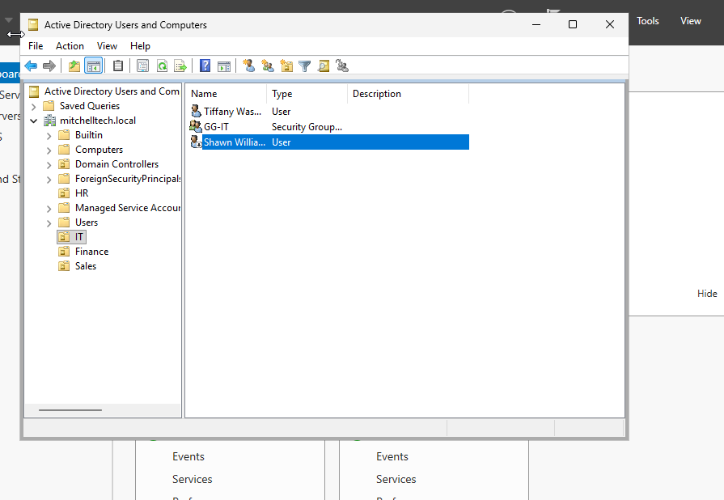

# Active Directory IAM Lab

## Overview
This lab demonstrates hands-on Identity and Access Management concepts using Windows Server 2025 and Active Directory Domain Services.

I built a simulated company environment, created users and security groups, organized accounts into departmental Organizational Units, and tested a Joiner-Mover-Leaver identity lifecycle scenario.

## Environment
- Oracle VirtualBox
- Windows Server 2025 Standard Evaluation
- Active Directory Domain Services
- DNS
- PowerShell
- Active Directory Users and Computers

## Domain
`mitchelltech.local`

## Skills Demonstrated
- Active Directory administration
- User provisioning
- Organizational Unit management
- Security group management
- Role-Based Access Control (RBAC)
- Least privilege
- Identity lifecycle management
- Joiner-Mover-Leaver processes
- Account disabling and deprovisioning
- Windows Server administration

## Active Directory Structure

The lab environment includes four departmental Organizational Units:

- HR
- IT
- Finance
- Sales

Each department contains a user account and a corresponding Global Security Group.

Examples:

- `GG-HR`
- `GG-IT`
- `GG-Finance`
- `GG-Sales`

## Joiner Scenario

A user account was provisioned in the Sales Organizational Unit and assigned membership in the `GG-Sales` security group.

This represents a new employee receiving access based on their job role.

## Mover Scenario

The employee was transferred from Sales to IT.

The following changes were performed:

- Removed membership from `GG-Sales`
- Added membership to `GG-IT`
- Moved the user account from the Sales OU to the IT OU
- Verified that the user's access reflected the new department

## Leaver Scenario

The employee was then simulated as leaving the organization.

The following actions were performed:

- Removed the user's remaining departmental group access
- Disabled the Active Directory account
- Verified that the account could no longer be used for authentication

## Security Concepts

### Role-Based Access Control
Instead of assigning permissions individually to users, access is associated with security groups based on job function.

### Least Privilege
Users should only retain access required for their current role. When the employee moved departments, the previous Sales access was removed before the new IT access was maintained.

### Identity Lifecycle Management
The lab demonstrates three common IAM lifecycle events:

**Joiner → Mover → Leaver**

These processes help organizations ensure that user access remains appropriate throughout the employee lifecycle.

## Key Takeaways

This lab helped me gain hands-on experience with Active Directory identity administration and understand how IAM teams manage user access throughout an employee's lifecycle.

I also practiced troubleshooting Windows Server, configuring Active Directory Domain Services, creating security groups, and managing user account access.

